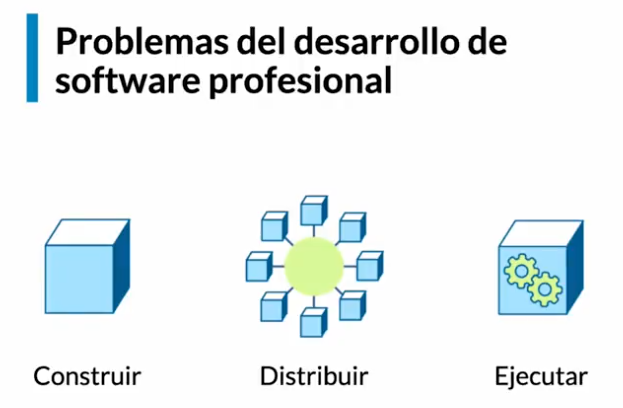
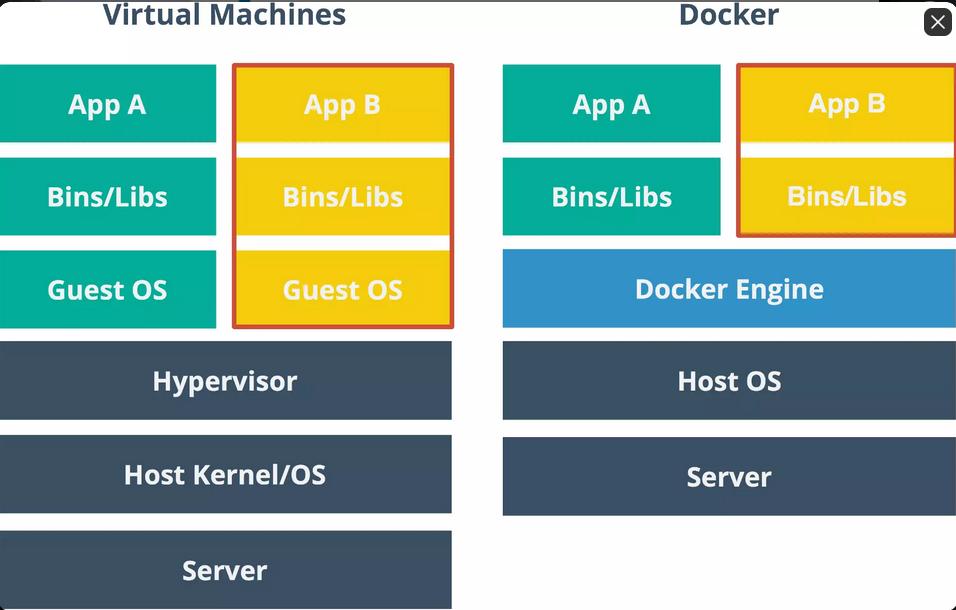
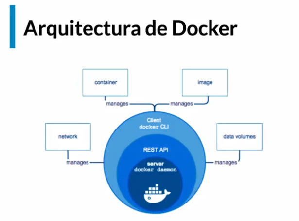

# Curso completo de Docker  
En este curso se ahondara mas en Docker que el curso pasado.
## 1. Problemas del desaerrollo de software profesional  
Existen tres problemas para el desarrollo de software. Esta construir, distribuir y ejecutar.  
  

### 1.1. Construir
Al momento de construir, debo garantizar que cuento con el mismo entorno de desarrollo, versiones de dependencia y mismo entorno de ejecucion. Adicional garantizando servicios externos.  
### 1.2. Distribuir Software  
El codigo debe convertirse en un artefacto o varios. Entonces el problema principal es que existen divergencias de repositorios y artefactos asi como versionado. Debo garantizar las mismas condiciones en la maquina.  
### 1.3. Ejecucion  
Siempre la maquina no va a ser la misma y se escribe de forma distinta a cuando se despliega en productivo.  
  
En este sentido, nos ayuda Docker debido a que permite distribuir y ejecutar cualquier aplicacion en cualquier lado.  
  
## 2. Virtualizacion  
Esto permite atacar en simultaneo los tres problemas del desarrollo de software profesional.  
Las diferencias entre docker y las maquinas virtuales se pueden ver de la siguiente manera:  
  
Varios de los problemas de las VM son el Peso, el costo de administracion y los multiples formatos.  
  
Por su parte, los contenedores sirven para meter los softwares y son livianos, flexibles, portables y bajo acoplamiento. Adicional son escalables y seguros.  
## 3. Arquitectura de Docker  
  
  
## 4. Que es un Contenedor?  
Es donde corren nuestras aplicaciones. Un contenedor es una maquina virtual muy ligera. Es una agrupacion logica de comandos. Permite limitar del host que puede ver y corre de forma nativa.  
## 5.  Comandos de Docker  
Para observar los contenedores corriendo
```bash
docker ps
```  
Agregando el flag -a podemos observar todos los que alguna vez corrieron.  
  
Para revisar la informacion y configuracion de una imagen de docker:  
```bash
docker inspect [containerid]
```  
Con el flag --name podemos asignarle un nombre a la imagen que estemos corriendo.  
```bash
docker run --name [nombre] [nombre_imagen]
```  
Por ejemplo:  
```bash
docker run --name hello-platzi hello-world
```  
  
Docker no permite tener varios contenedores con la misma informacion puedo usar el comando rename para cambiar el nombre del mismo.  
Por ejemplo:  
```bash
docker run rename hello-platzi hola-platzi
```  
Esto va a coger y lo va a renombrar.  
Para borrar todos los contenedores que esten apagados uso el siguiente comando:
Por ejemplo:  
```bash
docker container prune
```  
Para correr una terminal de bash de forma nativa dentro del SO usamos el siguiente el comando  
```bash
docker run -it ubuntu
```  
El flag -it hace que corra de forma interactiva y va a ir directamente al bash (terminal de comando).  
Cada vez que un contenedor se ejecuta, realmente ejecuta un proceso.  
  
El contenedor continuara vivo siempre y cuando su proceso principal este corriendo.  
Para que este no se apague cuando lo corro, utilizo este comando de ejemplo.  
Por ejemplo:  
```bash
docker run --name alwaysup -d ubuntu tail -f /dev/null
```  
En este comando en particular, lo que se realizo fue decirle a docker que la imagen de ubuntu corriese de forma persistente ejecutando el comando `-f /dev/null` 

Ahora bien, para acceder a la consola hago lo siguiente:  
```bash
docker exec -it [nombreimagen] bash
```  
Para inspeccionar el proceso que tiene arriba la maquina se utiliza el siguiente comando:  
```bash
docker inspect --format '{{.State.Pid}}' [nombreimagen]
```  
## 6. Exponiendo contenedores  
Para exponer contenedores usando la consola utilizo la siguiente
```bash
docker run --name [nombre-contenedor] -p [puerto-host]:[puerto-container] [imagen]
``` 
Por ejemplo: 
```bash
docker run --name proxy -d -p 8080:80 nginx
``` 
Esto va a correr la imagen de nginx y la habilitara para acceder por el puerto 8080 de mi maquina el flag `-d` es detach para que corra en background.  
Para ver los logs del docker de forma consecutiva realizamos lo siguiente:  
```bash
docker -f logs [nombre-contenedor]
```  
## 7. Montaje de Volumenes. 
Los montajes de volumenes sirven para trabajar con informacion de la maquina local. En este caso, usaremos una base de datos mongo. Para hacer un montaje usamos:  
```bash
docker run -d --name [nombre-contenedor] -v [ruta-local]:[ruta-contenedor] [nombre-imagen]
```  
Por ejemplo, para montar los datos de mi escritorio local y guardarlos con el contenedor arriba se escribe lo siguiente en consola:  
```bash
docker run -d --name db -v $(pwd)/mongodata:/data/db mongo
```  
En este ejemplo, se usa el comando `-d` para que corra por detras, con `--name` se asigna el nombre db y, finalmente, con `-v` se asigna el volumen. La variable de entorno `$(pwd)` imprime el working directory, y en esta esta creada la carpeta `/mongodata`. Adicional, la configuracion por default de mongo usa para guardar los datos la ruta `/data/db` y finalmente le indicamos que usaremos la imagen de `mongo`.  
  
### 7.1. Creando volumenes.
Para ver los volumenes que tenemos creados de forma nativa por docker:  
```bash
docker volume ls
```  
Este comando lista todos los volumenes creados.  
  
Por otro lado para crear otro volumen utilizamos el comando:
```bash
docker volume create [nombre]
```  
  
Ahora bien con el volumen ya creado, debemos ahora indicarle que montaremos un volumen de nuestro repositorio el cual sera estatico con la siguiente instruccion:  
```bash
docker run -d --name [nombre-container] --mount src=[nombre-volumen],dst=[carpeta-destino] [nombre-imagen]
```  
Es decir, diferente a lo que se hizo en el paso anterior usando un volumen de nuestro espacio en disco, lo que le indicamos es que con el volumen ya creado, lo asociamos a una carpeta destino. Para el ejemplo de mongo se hace lo siguiente:  
```bash
docker run -d --name db --mount src=dbdata,dst=/data/db mongo
```  
## 8. Insertar y extraer archivos de un contenedor  
Con un contenedor ya corriendo de ejemplo, el comando para copiar archivos dentro de la imagen de docker es el siguiente:  
```bash
docker cp [origen] [contenedor]:[ruta-archivo]
```  
Ejemplo:  
```bash
docker cp prueba.txt copytest:/testing/test.txt
```  
Y si fuese al reves?  
```bash
docker cp [contenedor]:[ruta-archivo] [directorio-local]
```  
Ejemplo:  
```bash
docker cp copytest:/testing localtesting
```  
## 9. Imagenes
Las imagenes son plantillas a partir de las cuales vamos a crear contenedores.  
Para ver las imagenes que tenemos de forma local:  
```bash
docker images
```  
Para traer imagenes ya creadas ya sea de un repo publico o uno privado usamos:  
```bash
docker pull [nombre-imagen]:[tag]
```